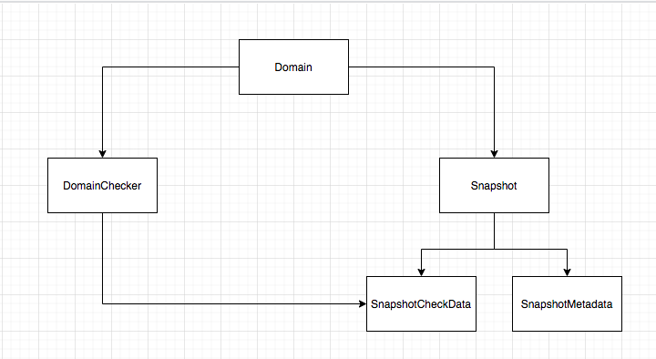

# Infrastructure

## kafka     
I followed this guide to set up a kafka service: https://medium.com/big-data-engineering/hello-kafka-world-the-complete-guide-to-kafka-with-docker-and-python-f788e2588cfc    

Using `docker-compose` I set up two topics, one for each business step that this project is composed:    
1- collector: this kind of task is responsible to get domains content using an HTTP GET requests    
2- regexp: for each `DomainChecker` a task of this type is generated and enqueued in this topic.

### topic creation (extracted from hello-kafka-world)
```
$KAFKA_HOME/bin/kafka-topics.sh --create --topic collector \
--partitions 4 --replication-factor 1 \
--bootstrap-server `broker-list.sh`

$KAFKA_HOME/bin/kafka-topics.sh --create --topic regexp \
--partitions 4 --replication-factor 1 \
--bootstrap-server `broker-list.sh`
```

## Postgresql
I set up a postgresql node with port mapping and other usefull configurations using this two posts    
1- https://stackabuse.com/working-with-postgresql-in-python/    
2- https://towardsdatascience.com/local-development-set-up-of-postgresql-with-docker-c022632f13ea    

Finally, create and run the container with this command:    
```
docker run -d --name dev-postgres -e POSTGRES_PASSWORD=Pass2020! \
-v ~/postgres-data/:/var/lib/postgresql/data \
-p 5432:5432 \
postgres
```

# Project Entities

- **Domain**: Entity that represents the domains to be tracked.     
- **DomainChecker**: Entity where all desired checks will be created and related with a Domain    
- **Snapshot**: Each pull run against a `Domain`. It stores the html    
- **SnapshotMetadata**: Stats generated by the HTTP GET request. It is splitted from `Snapshot` it allows to retrieve only metadata without getting the raw html that could become huge and slow down the query, hitting the project infrasctructure.     
- **SnapshotCheckData**: Results from running each `DomainChecker` are stored in this table

# How to put it all together
There's two ways of verifying that this projects runs as expected.    
First one is running `test.py` and checking that all tests run ok:    

```
$ python tests.py
...
...
...
----------------------------------------------------------------------
Ran 4 tests in 3.072s
```
The other one is starting kafka and postgresql services, starting consumers and then start producing tasks 

